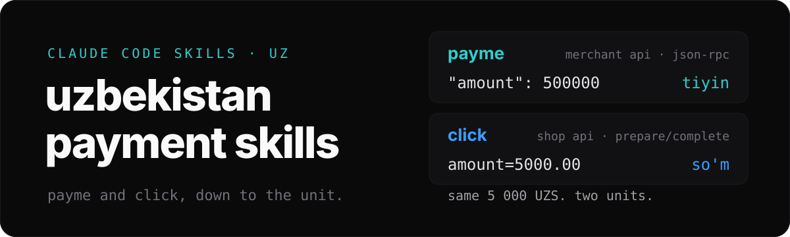

<div align="center">



<p>
<a href="https://skills.sh/ubranch/uzbekistan-payment-skills"></a>


<a href="#install"></a>
</p>

</div>

Two agent skills for accepting payments in Uzbekistan. `payme-integration`
covers Payme Business. `click-integration` covers Click. Each is a plain
`SKILL.md` with reference files, so it can be installed in Claude Code, Codex,
Cursor, Gemini CLI, GitHub Copilot, OpenCode, and other agents supported by the
[skills CLI](https://github.com/vercel-labs/skills#supported-agents).
Skill selection and activation depend on your agent. The descriptions include
provider terms in Uzbek, Russian, and English; the references cover request
formats, signatures, error codes, transaction states, sandbox testing, and
fiscalization.

## look

The two providers solve the same problem in different ways. Most integration
bugs come from these differences. Both skills state them explicitly:

| | payme | click |
| --- | --- | --- |
| **they call you** | Merchant API, JSON-RPC 2.0 | SHOP API, Prepare (`action=0`) and Complete (`action=1`) |
| **request body** | JSON | `application/x-www-form-urlencoded` |
| **5 000 UZS is** | `500000`, an integer in tiyin | `5000.00`, a float in so'm |
| **auth** | Basic auth with KEY or TEST KEY, `-32504` on failure | MD5 `sign_string`, parameters joined without separators |
| **you call them** | Subscribe API: `cards.*`, `receipts.*`, `X-Auth` header | Merchant API: invoices, payments, card tokens, SHA1 `Auth` digest |

## install

Install from the public GitHub repository using the [skills CLI](https://skills.sh/docs):

```bash
npx skills add ubranch/uzbekistan-payment-skills
```

The CLI asks which skills and agents to target. To install both skills for
every supported agent in the current project:

```bash
npx skills add ubranch/uzbekistan-payment-skills --all
```

Or install one skill for one agent without prompts:

```bash
npx skills add ubranch/uzbekistan-payment-skills --skill payme-integration --agent codex --yes
```

Add `--global` for user-level installation. To check discovery without installing:

```bash
npx skills add ubranch/uzbekistan-payment-skills --list
```

Claude Code, as a plugin marketplace:

```bash
/plugin marketplace add ubranch/uzbekistan-payment-skills
/plugin install payme-integration@uzbekistan-payment-skills
/plugin install click-integration@uzbekistan-payment-skills
```

Already installed the old Claude plugins? Refresh the marketplace and update
both plugins to `1.1.0`, then restart Claude Code to replace the old cached layout:

```bash
claude plugin marketplace update uzbekistan-payment-skills
claude plugin update payme-integration@uzbekistan-payment-skills
claude plugin update click-integration@uzbekistan-payment-skills
```

Or copy `skills/<name>/` into your agent's skills folder by hand. Each skill
works alone.

Try: “Use payme-integration to implement Merchant API callbacks for a 5 000 UZS
order. Include transaction state handling and sandbox verification.”

### skills.sh discovery

[Payme](https://skills.sh/ubranch/uzbekistan-payment-skills/payme-integration) ·
[Click](https://skills.sh/ubranch/uzbekistan-payment-skills/click-integration)

There is no separate upload step: publish the repository, then install through
the CLI. [skills.sh ranks skills using anonymous installation telemetry](https://skills.sh/docs).
Directory visibility may lag behind installation; GitHub-based installs work
independently of listing availability.

## skills

### payme-integration

Loads for Payme, Paycom, `checkout.paycom.uz`, Merchant API, Subscribe API,
to'lov tizimi, fiskalizatsiya, and IKPU codes.

- **Merchant API**: all six methods plus `SetFiscalData`, transaction states,
  cancel reasons, the IP whitelist, and every error code.
- **Subscribe API**: card tokenization, verification by SMS code, and receipts.
- **Other**: payment button and QR code, Telegram bots, the Android SDK, CMS
  plugins, and where to find the kassa ID and KEY.

### click-integration

Loads for Click, `click.uz`, SHOP API, `click_trans_id`, `merchant_trans_id`,
Click Pass, `checkout.js`, and Click error codes `-1` to `-9`.

- **SHOP API**: Prepare and Complete, signature checks, errors, and testing.
- **Merchant API**: invoices, payment status, card tokens, and reversal.
- **Checkout**: payment button, inline `checkout.js`, Click Pass (QR POS).
- **Other**: fiscalization (OFD and IKPU), Telegram payments, the mobile SDK,
  server examples, and WooCommerce, OpenCart, and 1C-Bitrix plugins.

## limits

The skills hold documentation, not code that runs. They reflect the provider
docs at the time of writing. Check `developer.help.paycom.uz` and `docs.click.uz`
before you go to production.

## license

[MIT](./LICENSE)
